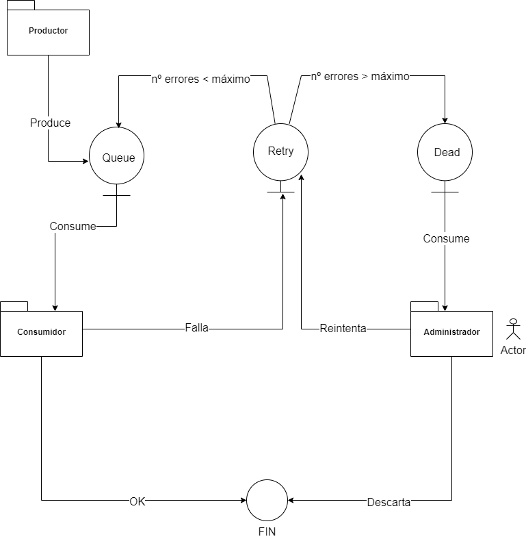

# Rallibau ddd backend ☕🚀!!

## _Una implementación de ddd respetuosa con los principios SOLID_ 

## ℹ Introducción 

## ☝ Dependencias

Necesitas tener la jdk 1.8

## 🏁 Iniciando

1. Clonar el repositorio: https://gitlab.visual-limes.com/ramon.llinares/ramon-llinares-test
2. Importar al ID
3. Disfrutar!

## 🏗️ Construir y desplegar
### En windows:
- Compilar:  .\gradlew.bat build
- Desplegar: .\gradlew.bat run
- Compilar imagen docker: .\gradlew.bat build --warning-mode all y después  docker build -t visual-limes-java .
### En linux
- Compilar:  .\gradlew build
- Desplegar: .\gradlew run
- Compilar imagen docker: .\gradlew build --warning-mode all && docker build -t visual-limes-backend .

## 📦 Generar versión imagen
### Frontend
- yarn build
- docker build -t rallibau/frontend-generador-etiquetas .
- docker tag rallibau/frontend-generador-etiquetas  rallibau/frontend-generador-etiquetas:1.0.1
- docker push  rallibau/frontend-generador-etiquetas:1.0.1

### Backend 
- Compilar:  .\gradlew.bat build
- docker build -t rallibau/rallibau-backend .
- docker tag rallibau/rallibau-backend  rallibau/rallibau-backend:1.0.1
- docker push  rallibau/rallibau-backend:1.0.1 

## 📬 Mensajería para integraciones

Install zlib from it's source, solve my similar error. Download last version from this then:

configure
make -j4
make install

https://gist.github.com/fernandoaleman/5459173e24d59b45ae2cfc618e20fe06

